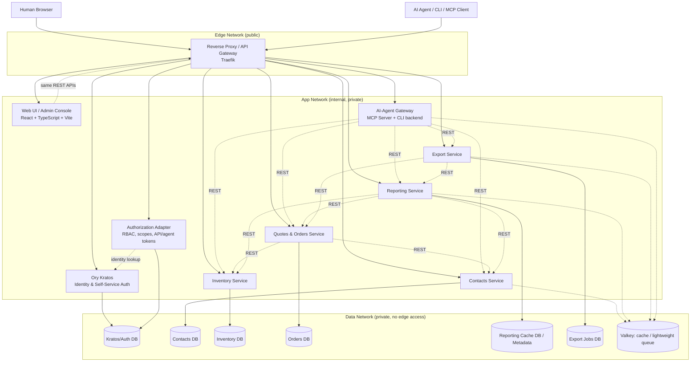

# PRD — Source-Available Modular ERP Platform

| | |
|---|---|
| **Status** | Draft v0.3 |
| **Date** | 2026-06-19 |
| **Owner** | TBD |
| **Audience** | Solo / micro-business operators, self-hosters, source-available contributors |
| **Deployment target** | Single-host Docker Compose (v1) |
| **License model** | Commercial-use source-available license; no redistribution; attribution/credits must remain |

---

## 1. Overview & Vision

A source-available, modular ERP-style system for solo operators and very small businesses who want to **self-host** their core business data (contacts, inventory, quotes/orders, reporting) instead of depending on SaaS platforms.

The defining architectural bet of this product is that **every business capability is an independent, REST-API-first microservice**, network-segmented from its neighbors, and the whole stack is **deployable with a single `docker compose up`** on commodity hardware (a VPS, a NAS, a home server).

The product must expose the same capabilities to three first-class access paths:

1. **Human Web UI** — a full-featured browser interface where every supported API action is human-accessible.
2. **REST API** — versioned APIs for integrations, automation, and power users.
3. **AI-agentic access** — Claude Code, Codex CLI, and other MCP-capable agents can operate the ERP directly, safely, and auditable via MCP and CLI.

The project is still intended to be transparent and modifiable by self-hosters, but the requested license terms are **not OSI-open-source compatible** because they prohibit redistribution. Therefore, this PRD uses the term **source-available** instead of open source for the product license, while requiring permissive/open-source compatible third-party dependencies.

---

## 2. Goals & Non-Goals

### 2.1 Goals

- Modular architecture: each business capability is a separate, independently deployable service with its own data store.
- All inter-module communication happens over **REST APIs only** — no shared database access between modules.
- **Full Web UI parity:** every supported public API operation must be reachable through a human-facing UI surface.
- **Microsegmented infrastructure:** services are isolated into Docker networks by trust zone (edge / app / data), least-privilege by default.
- One-command self-hosting via **Docker Compose**, runnable on a single small VPS (2 vCPU / 4 GB RAM class).
- **Ory Kratos as the authentication provider** for human identity, login, registration, recovery, verification, MFA-capable flows, and session handling.
- **AI-agentic access** as a first-class module: Claude/Codex and other MCP clients can read and act on ERP data through a scoped, audited interface — not through an implicit superuser backdoor.
- **AI-native implementation governance:** the repository must include clear rules, issue templates, feature-slice workflows, and review gates so Claude Code, Codex CLI, and similar development agents can implement safely without weakening architecture, security, licensing, or UI quality.
- Clean module boundaries that allow contributors to add new modules without touching existing ones.
- Commercial internal use permitted under the product license, while prohibiting redistribution and requiring credits/attribution to remain intact.

### 2.2 Non-Goals (v1)

- Multi-tenant SaaS hosting.
- Full statutory accounting / bookkeeping / tax filing.
- Payroll/HR.
- Native mobile apps.
- High-availability / multi-node clustering.
- Public marketplace for third-party modules.
- OIDC/OAuth2 provider behavior for external applications unless explicitly added later with Ory Hydra or another authorization server.

---

## 3. Target Users & Core Use Cases

**Primary persona:** A solo founder or micro-business owner (1–5 people) who is technical enough to run `docker compose up -d` but does not want to operate Salesforce/SAP-grade complexity, and wants their business data to stay under their own control.

Representative use cases:

- "I want one place to keep customers and suppliers, separate from my email."
- "I want to track what's in stock and get warned before I run out."
- "I want to send a quote, have it become an order once accepted, and see what's still open."
- "I want a dashboard with sales, average ticket, upcoming work, stock alerts, and assistant actions."
- "I want a monthly report of revenue, top customers, and stock value, exportable to Excel."
- "I want every API action to also be possible in the Web UI, so I do not need Postman or a CLI for normal operations."
- "I want to ask Claude to draft a quote for customer X from this week's inquiry, and have it actually create the quote in the system — without giving it the keys to delete my database."

---

## 4. Architecture Tenets

1. **API-first, API-only.** No module reads another module's database directly. All cross-module data flows through versioned REST APIs.
2. **Web UI as API client, not special path.** The Web UI must use the same public REST APIs as external clients and AI agents. It must not bypass API validation or call service databases directly.
3. **Database-per-service.** Each module owns its schema/data exclusively.
4. **Least-privilege networking.** Services only see the network segments they need; databases are never reachable from the edge network.
5. **Stateless services.** Business logic services hold no local state outside their own DB, so they can be restarted, scaled, or replaced independently.
6. **Ory Kratos for identity.** Kratos owns identities and self-service auth flows. Application-specific authorization remains in an ERP authorization layer that maps Kratos identities to roles/scopes.
7. **Agent-safe by design.** Anything an AI agent can do via MCP/CLI is scoped, rate-limited, and logged the same way a human API client would be.
8. **Boring, well-documented core.** Optimize for a solo maintainer's ability to operate and debug the system, not for theoretical hyperscale.
9. **AI-assisted development is governed.** Development agents may implement only from explicit plans, one feature slice at a time, and must follow repository-level guardrails.
10. **License hygiene by default.** Third-party components must be license-reviewed before inclusion; dependencies with copyleft/network-service obligations are excluded from the default stack unless explicitly isolated and documented.

---

## 5. System Architecture

### 5.1 High-Level Diagram



Every module-to-module arrow is a REST call carrying a short-lived service token or a propagated user/agent context. No module is permitted a direct connection to another module's database. This is enforced both organizationally (code review and architecture tests) and technically (network policy, Docker network membership, Postgres roles).

### 5.2 Network Segmentation (Docker)

Three Docker Compose networks, each a distinct trust zone:

| Network | Members | Reachable from | Purpose |
|---|---|---|---|
| `edge` | Reverse proxy / gateway only | Internet | Only network exposed publicly. TLS termination, routing, rate limiting, request logging. |
| `app` | Web UI, Ory Kratos, Authorization Adapter, business services, AI-Agent Gateway | `edge` through gateway, other approved `app` members | REST-to-REST module calls and UI/API routing. |
| `data` | PostgreSQL, Valkey | Only their owning service(s) | Persistent storage and queue/cache. Never directly exposed, never reachable from `edge`. |

Concretely: the reverse proxy container is the **only** container attached to `edge`. Databases are **never** attached to `edge`. Each business service is attached to `app` and to `data`, but is only provisioned credentials for its own database. Compose network aliases and Postgres roles ensure a service can authenticate only to its own database, even though all module databases share one Postgres instance by default.

### 5.3 Recommended Tech Stack

Concrete recommendation optimized for **solo-maintainer velocity + low operational footprint + full Web UI + first-class AI/MCP support**:

| Concern | Recommendation | Decision |
|---|---|---|
| Backend service language/framework | **Python 3.12 + FastAPI** | Auto-generated OpenAPI specs per service, fast CRUD development, mature export/reporting ecosystem, good AI-agent integration. |
| ORM / data layer | SQLAlchemy 2.x + Alembic migrations | Standard, well-documented, per-service isolated schema migrations. |
| Database | **PostgreSQL, one instance with one database per module** | Recommended v1 default. Keeps resource footprint low while preserving ownership boundaries. Separate Postgres instances remain an advanced profile. |
| Cache / lightweight queue | **Valkey** | Redis-compatible operational model with permissive BSD-style licensing; avoids Redis licensing ambiguity in the default stack. |
| Reverse proxy / API gateway | Traefik | Docker-label-based routing, Let's Encrypt support, good fit for self-hosted Compose deployments. |
| Auth provider | **Ory Kratos** | Required decision. Kratos handles identity, browser flows, recovery/verification, and session lifecycle. |
| Authorization layer | Small ERP Authorization Adapter | Maps Kratos identities to ERP roles/scopes, issues/validates service and agent tokens, enforces RBAC/ABAC decisions. |
| Web UI | **React + TypeScript + Vite** | Lightweight SPA/container, consumes generated OpenAPI clients, avoids a second backend runtime. |
| UI system | Tailwind CSS + shadcn/ui + Radix primitives + Lucide icons | Fast dashboard development with accessible components and a customizable design system. |
| Data fetching/tables/forms | TanStack Query, TanStack Table, React Hook Form, Zod | Typed forms and server-state handling for CRUD-heavy ERP screens. |
| Charts | Recharts | Sufficient for dashboard cards, time-series, and report previews. |
| AI-agentic access | MCP server using the official Python MCP SDK, plus a thin CLI wrapping the same REST clients | Reuses the same audited REST API every human client uses — no special backdoor. |
| Export/reporting | pandas, openpyxl, ReportLab | CSV/XLSX/PDF generation with mature Python libraries. |

**Alternative stacks considered:**

- *Node.js/TypeScript end-to-end* — viable if one language across backend and frontend is prioritized, but FastAPI remains stronger for quick OpenAPI-heavy service development and Python reporting/export tooling.
- *Next.js instead of Vite* — useful if server rendering, edge middleware, or route handlers become important, but v1 does not need a second server layer because the backend already provides APIs.
- *Go for services* — best raw efficiency and small containers, but slower iteration for CRUD/reporting-heavy modules.

### 5.4 Cross-Cutting Services

#### Ory Kratos — Identity Provider

Ory Kratos is the required auth provider for v1.

Responsibilities:

- Human identity lifecycle: registration, login, logout, recovery, verification.
- Session lifecycle for browser users.
- MFA-capable user flows where enabled.
- Identity traits / profile data needed for authentication.

Non-responsibilities:

- Business roles like `inventory.manager` or `orders.viewer`.
- Service-to-service authorization.
- Agent token scoping.
- Audit log ownership.

Those ERP-specific authorization responsibilities live in the Authorization Adapter.

#### Authorization Adapter

A small internal service that bridges Kratos identities into ERP-specific authorization.

Responsibilities:

- Map Kratos identity IDs to ERP users.
- Store roles, groups, scopes, and permissions.
- Issue short-lived service-to-service tokens.
- Issue and revoke API keys / agent tokens.
- Expose `/me`, `/permissions`, `/tokens`, and audit-relevant auth metadata.
- Provide a shared policy decision API for services that need centralized authorization decisions.

#### API Gateway (Traefik)

- TLS termination.
- Path-based routing (`/`, `/auth/*`, `/api/v1/contacts/*`, `/api/v1/inventory/*`, ...).
- Rate limiting.
- Request logging.
- Security headers.
- Optional forward-auth integration where suitable.

#### Web UI / Admin Console

The Web UI is a first-class service, not an optional admin afterthought.

Responsibilities:

- Expose all supported public REST operations to human users.
- Provide CRUD screens, dashboards, forms, reports, exports, token management, and audit views.
- Use generated OpenAPI clients to avoid drift between UI and backend.
- Support light and dark mode from day one.
- Provide a built-in API/action explorer for advanced users.

#### AI-Agent Gateway

The MCP server + CLI backend. It translates MCP tool calls / CLI commands into the exact same REST calls a human client would make, under a scoped agent token. See §6.7.

### 5.5 Data Ownership Model

- Database-per-service: each module's schema/data is private; nobody else may connect to it.
- V1 default: one PostgreSQL instance with one database per module.
- Advanced isolation profile: one PostgreSQL container per module, only if resources allow.
- Cross-module reads happen via REST, not SQL joins.
- References between modules are stored as opaque IDs plus denormalized display snapshots where useful.
- Where a synchronous REST call to enforce consistency would be fragile, use a **compensating-action pattern** for v1, with a Valkey-backed event stream as a v2 upgrade once a second consumer module needs the same event.

### 5.6 API and Web UI Parity Contract

Every public REST endpoint must be classified into one of four Web UI parity states:

| State | Meaning | Required before GA? |
|---|---|---|
| `first-class-ui` | Full screen/workflow exists with validation, permissions, empty states, and error handling. | Yes for normal business operations. |
| `admin-ui` | Available in an admin/developer screen, such as token management or API action explorer. | Yes for operational/admin endpoints. |
| `hidden-system` | Internal health/readiness/service endpoints not meaningful to a normal human user. | Allowed with documentation. |
| `deprecated` | Endpoint remains for compatibility but is not presented as a primary action. | Allowed with migration notes. |

Acceptance criteria:

- Every documented API endpoint appears in the UI parity registry.
- No business write endpoint may ship without either a first-class UI workflow or an admin UI action.
- The Web UI must call the same REST endpoint as external users and agents.
- OpenAPI definitions are the source of truth for generated UI clients and API docs.
- The UI action explorer must expose advanced operations that are valid for humans but do not justify a dedicated screen in v1.

Each endpoint entry in the parity registry must include:

| Field | Required meaning |
|---|---|
| Endpoint / capability | Human-readable action and OpenAPI operation ID. |
| UI parity state | `first-class-ui`, `admin-ui`, `hidden-system`, or `deprecated`. |
| UI location | Screen, drawer, dialog, or admin/API explorer path. |
| Required role/scope | Minimum ERP role/scope required to use the action. |
| Confirmation level | None, normal confirmation, danger confirmation, or human approval queue. |
| Audit requirement | Whether the action is logged and which payload summary is stored. |
| Screenshot evidence | Required for first-class UI actions in light and dark mode. |

Example parity mapping:

| API capability | UI surface | Confirmation | Audit log |
|---|---|---:|---:|
| Create contact | Contacts create/edit dialog | No | Yes |
| Delete contact | Contact detail danger zone | Yes | Yes |
| Reserve stock | Order confirmation flow | Yes | Yes |
| Export report | Reports / Export builder | No | Yes |
| Create agent token | Admin / Agent Access | Yes | Yes |

---

## 6. Core Modules

> Each module: own REST API under `/api/v1/<module>`, own OpenAPI spec, own database, own Docker Compose service, independently testable/deployable, and UI parity entries for all public endpoints.

### 6.1 Contacts

**Purpose:** System of record for people and organizations the business deals with — customers, suppliers, leads.

**Key entities:** `Contact`, `Address`, `CommunicationChannel`, `Tag`, `Note/Activity`, contact `Type`, `OrganizationMembership`.

**Core API features:**

- CRUD with pagination, filtering, full-text search.
- Tagging and categorization.
- Duplicate detection on create.
- Activity/notes timeline per contact.
- Bulk import and export.

**Required Web UI:**

- Contacts list with search, filters, saved views, tags, and pagination.
- Contact detail page with addresses, communication channels, activity timeline, related quotes/orders, and export actions.
- Create/edit dialogs with duplicate warning.
- Bulk import wizard with column mapping and validation preview.
- Bulk actions: tag, export, merge duplicate candidates.

**Sample API:** `GET/POST /contacts`, `GET/PATCH/DELETE /contacts/{id}`, `GET /contacts/{id}/addresses`, `GET /contacts/{id}/activity`.

**Consumed by:** Quotes & Orders, Reporting, AI-Agent Gateway, Web UI.

### 6.2 Inventory

**Purpose:** Track sellable items, stock levels across locations, and stock movements.

**Key entities:** `Item`, `Location`, `StockLevel`, `StockMovement`, `Category`.

**Core API features:**

- CRUD items and locations.
- Stock movement ledger.
- Low-stock threshold alerts.
- Stock reservation API.
- Supplier linkage via `Contact` reference.

**Required Web UI:**

- Inventory dashboard with low-stock cards, total stock value, recent movements, and location overview.
- Item list with SKU search, category filters, stock status, and quick adjustments.
- Item detail page with stock by location, movement ledger, supplier link, price history, and reservations.
- Stock adjustment workflow with reason codes and audit preview.
- Location management screen.

**Sample API:** `GET/POST /items`, `GET /items/{id}/stock`, `POST /stock-movements`, `POST /items/{id}/reserve`, `POST /items/{id}/release`.

**Consumed by:** Quotes & Orders, Reporting, AI-Agent Gateway, Web UI.

### 6.3 Quotes & Orders

**Purpose:** Manage the sales lifecycle from quote to fulfilled order.

**Key entities:** `Quote`, `QuoteLineItem`, `Order`, `OrderLineItem`, `StatusHistory`.

**Status flow:** `Draft ? Sent ? Accepted/Rejected ? Converted to Order ? Fulfilled`.

**Core API features:**

- Create/edit quotes with line items, discounts, tax handling.
- Convert an accepted quote into an order.
- Reserve stock on confirmation and record stock movement on fulfillment.
- Validated status transitions.
- PDF generation through Export.

**Required Web UI:**

- Quote pipeline board and list/table view.
- Quote editor with customer picker, item picker, pricing, discounts, tax, and live totals.
- Quote preview and PDF/export action.
- Convert-to-order workflow with stock reservation preview.
- Order list, order detail, fulfillment flow, and status history timeline.
- Guardrails for destructive/high-impact actions.

**Sample API:** `GET/POST /quotes`, `POST /quotes/{id}/convert`, `GET/POST /orders`, `POST /orders/{id}/transition`.

**Depends on:** Contacts, Inventory. **Consumed by:** Reporting, Export, AI-Agent Gateway, Web UI.

### 6.4 Reporting

**Purpose:** Aggregate data across modules into dashboards and predefined reports, without owning primary business data itself.

**Approach:** Pure read-side aggregator. Pulls from Contacts/Inventory/Orders over REST with Valkey caching.

**Core API features:**

- Predefined report templates with date ranges and filters.
- Dashboard summary endpoint.
- Scheduled report generation.
- Report preview endpoints.

**Required Web UI:**

- Home dashboard with cards for revenue, open quotes, average ticket, top customers, stock value, low-stock alerts, and upcoming work.
- Report library with templates.
- Date range and filter controls.
- Chart cards and table previews.
- Schedule report wizard.
- Export-to-CSV/XLSX/PDF actions.

**Sample API:** `GET /reports/sales-by-period`, `GET /reports/stock-valuation`, `GET /reports/top-customers`, `GET /dashboard/summary`.

**Depends on:** Contacts, Inventory, Orders. **Consumed by:** Export, Web UI, AI-Agent Gateway.

### 6.5 Flexible Data Export

**Purpose:** Generic export engine usable by any module — CSV, Excel (`.xlsx`), JSON, and PDF.

**Core API features:**

- Field-mapping/templates per export.
- One-off and scheduled exports.
- Delivery via direct download, webhook, or file-drop.
- Quote/order PDF documents.

**Required Web UI:**

- Export builder with source selection, filters, field mapping, format choice, and preview.
- Saved export templates.
- Export job history with status and download links.
- Scheduled export configuration.
- PDF template preview for quotes/orders.

**Sample API:** `POST /exports`, `GET /exports/{id}`, `GET /exports/{id}/download`.

**Depends on:** Reporting, Orders. **Consumed by:** Web UI, AI-Agent Gateway.

### 6.6 Web UI / Admin Console

**Purpose:** Provide a complete human-accessible interface for everything available through supported API calls.

**Core UX principles:**

- Dashboard-first layout inspired by the provided reference image: soft cards, rounded surfaces, calm blue/purple accent palette, left navigation, compact KPI cards, chart panels, and an assistant/action panel.
- Must be visually inspired by the reference, not a pixel copy.
- Light and dark mode as first-class themes.
- Responsive web design for desktop and tablet; phone layout is usable but not optimized like a native app.
- Keyboard-accessible workflows.
- Clear empty states, loading states, and error states.
- No dead-end admin operations that require raw API calls for normal use.

**Navigation model:**

- Home / dashboard
- Agenda / tasks / upcoming commitments
- Contacts
- Inventory
- Quotes
- Orders
- Finance-lite / revenue reports
- Reports
- Exports
- AI Assistant / Agent activity
- Audit log
- Settings
- Admin: users, roles, API keys, service tokens, system health

**Required screens:**

| Area | Required UI |
|---|---|
| Dashboard | KPI cards, charts, recent activity, upcoming work, low-stock warnings, quick actions. |
| Auth | Kratos-backed login, registration, recovery, verification, account settings. |
| Contacts | List/detail/create/edit/import/export/merge. |
| Inventory | Item/location/stock movement/reservation screens. |
| Quotes & Orders | Quote editor, pipeline, conversion, order fulfillment, PDF preview. |
| Reporting | Report templates, filters, chart/table previews, scheduled reports. |
| Export | Export builder, templates, job history, downloads. |
| AI/Agent | MCP tool catalogue, agent token management, recent agent runs, confirmation queue. |
| Audit | Filterable audit log with actor, endpoint/tool, payload summary, result, timestamp. |
| Settings | Locale, currency, theme, organization profile, module toggles. |
| Admin/API Explorer | Human-accessible operation launcher for advanced API actions not requiring dedicated screens. |

**Theming requirements:**

- Light mode and dark mode are both required in Phase 0.
- Theme can follow system preference and be manually overridden.
- Design tokens must be centralized: background, surface, surface-elevated, border, muted text, accent, success, warning, danger.
- Charts must be theme-aware and readable in both modes.
- Use semantic tokens rather than hard-coded colors in feature components.

**Visual QA workflow:**

Every major UI feature must be reviewable through screenshots before merge.

Required screenshot evidence:

- Desktop light mode.
- Desktop dark mode.
- Narrow/tablet viewport where the screen layout materially changes.
- Annotated or described visual differences when a change is based on screenshot feedback.
- Known visual limitations or follow-up tasks.

Screenshot feedback should be treated as product input. The preferred loop is: provide screenshot, mark the issue, describe the desired state, then implement the smallest UI change that satisfies the feedback.

### 6.7 AI-Agentic Access (Codex / Claude via CLI & MCP)

**Purpose:** Let AI coding/agent tools operate the ERP directly and safely, as a peer to the human Web UI/API user — not a privileged backdoor.

**Components:**

- **MCP server**, exposing one MCP tool per meaningful business action.
- **CLI** (`erp` binary), using the same underlying API client library as the MCP server.
- **Agent identity & scoped tokens**, managed through the Authorization Adapter and visible in the Web UI.
- **Audit log**, including every agent-initiated action.
- **Confirmation mode**, configurable for destructive/high-impact actions.
- **Rate limiting**, per token and per tool.
- **Web UI confirmation queue**, so humans can approve pending agent actions.

**Example MCP tools:**

- `contacts.search`
- `contacts.create`
- `inventory.check_stock`
- `inventory.adjust_stock`
- `quotes.create`
- `quotes.convert_to_order`
- `orders.transition`
- `reports.run`
- `exports.create`

**Example use cases:**

- "Claude, create a quote for [customer] based on this week's email inquiry" ? `contacts.search` ? `quotes.create`.
- "Codex, generate this month's stock valuation report as Excel" ? `reports.run` ? `exports.create`.

**Depends on:** Ory Kratos indirectly through the Authorization Adapter, and every other module via REST exactly like a human client.

---

## 7. Non-Functional Requirements

### 7.1 Security

- TLS through Traefik + Let's Encrypt for deployments with a domain.
- Ory Kratos handles user identity and browser auth flows.
- ERP Authorization Adapter handles roles, scopes, service tokens, and agent tokens.
- Secrets via `.env`/Docker secrets, never committed.
- RBAC enforced at the API layer, not only in the UI.
- Full audit logging for write operations, especially agent-initiated operations.
- Dependency scanning and license scanning in CI.
- Security headers on the Web UI.
- CSRF/session handling aligned with Kratos browser-flow recommendations.
- Public API endpoints require explicit auth strategy: session, API token, service token, or public health endpoint.

### 7.2 Scalability

- V1 targets a single host.
- Services are stateless so horizontal scaling is possible later.
- Web UI is static/SPA-like and can be served by a tiny container.
- Reporting and export jobs run through Valkey-backed queues.

### 7.3 Observability

- Structured JSON logging per service.
- `/health` and `/ready` endpoints on every service.
- Optional Prometheus/Grafana stack as a separate Compose profile (`--profile observability`).
- UI system health screen showing service readiness and queue state.
- Audit log is queryable from both API and Web UI.

### 7.4 Backup/Restore

- Documented `pg_dump`-based backup script per database.
- Docker volume backup guidance.
- Restore procedure tested and documented.
- Kratos/Auth DB is included in backup plan.
- Export artifacts and generated PDFs are backed up according to retention settings.

### 7.5 Resource Footprint

- Core stack should run comfortably on 2 vCPU / 4 GB RAM:
  - Traefik
  - Web UI
  - Ory Kratos
  - Authorization Adapter
  - Contacts
  - Inventory
  - Orders
  - Reporting
  - Export
  - AI-Agent Gateway
  - one PostgreSQL instance
  - Valkey
- Observability stack is optional and may require more memory.

### 7.6 Internationalization

- Initial locale support for English and German.
- Date, currency, number formatting are locale-aware.
- UI translation strings externalized from day one.
- Organization currency setting used consistently in dashboards, quotes, orders, and exports.

### 7.7 Accessibility and UX Quality

- Keyboard-accessible navigation and forms.
- Sufficient contrast in light and dark modes.
- Form validation errors are visible and understandable.
- Destructive actions require confirmation.
- Long-running jobs show progress/status.
- UI should remain usable on tablet-sized screens.

### 7.8 Compliance

- Contacts module must support data export/deletion of an individual's data.
- Audit log retention is configurable.
- Privacy-relevant exports are logged.
- Kratos identity data must be included in documented data subject request flows.

### 7.9 Licensing

- Product license is a **commercial-use source-available license**, not OSI open source, because the requested no-redistribution condition conflicts with open-source definitions.
- Users may use the software commercially for their own business.
- Redistribution, resale, public SaaS hosting, and removal of credits/attribution are prohibited unless a separate commercial license is granted.
- Third-party notices must be preserved.
- Default dependencies must be permissive or otherwise compatible with this distribution model.
- Copyleft/network-service/copyleft-like dependencies are excluded from the default runtime unless explicitly isolated and approved.

---

## 8. Deployment Model

- Single `docker-compose.yml` defining:
  - Traefik
  - Web UI
  - Ory Kratos
  - Authorization Adapter
  - Contacts
  - Inventory
  - Orders
  - Reporting
  - Export
  - AI-Agent Gateway
  - PostgreSQL
  - Valkey
- Optional `--profile observability` for Prometheus/Grafana.
- All configuration via a single `.env` file.
- Bootstrap script (`./init.sh`) that:
  - brings up the stack,
  - runs DB migrations for every service,
  - applies Kratos migrations/config,
  - seeds a default admin user,
  - creates initial roles/scopes,
  - optionally creates an initial agent token,
  - verifies UI/API health.
- Each module also ships its own minimal `docker-compose.<module>.yml` so it can be run/tested standalone.
- Target: a new self-hoster goes from `git clone` to a working system in under 15 minutes on a fresh VPS.
- Web UI served at `/`.
- Kratos self-service flows routed under `/auth/*`.
- APIs routed under `/api/v1/*`.

---

## 9. Roadmap / Phased Delivery

| Phase | Scope |
|---|---|
| **Phase 0 — Foundations** | Repo/monorepo skeleton, Docker network segmentation, Traefik, Ory Kratos, Authorization Adapter, PostgreSQL one-instance/multi-database setup, Valkey, Web UI shell, design tokens, light/dark mode, generated OpenAPI client pipeline, CI, health checks, license scanning. |
| **Phase 1 — Core Data** | Contacts and Inventory services plus full Web UI screens for CRUD, search, import/export basics, audit logging, and standalone module smoke tests. |
| **Phase 2 — Sales Workflow** | Quotes & Orders service, UI quote editor, quote pipeline, order conversion, stock reservation workflows, PDF preview integration. |
| **Phase 3 — Insight & Output** | Reporting module, dashboard, report library, chart/table previews, Flexible Export module, export builder, scheduled export UI. |
| **Phase 4 — AI-Agentic Access** | MCP server, CLI, scoped agent tokens, Web UI token management, audit log, confirmation queue for high-impact agent actions. |
| **Phase 5 — Hardening & Extensibility** | Backup/restore tooling, optional observability profile, module SDK/template, advanced permissions, API parity registry enforcement, dependency/license review automation, groundwork for optional invoicing/accounting module. |

### 9.1 One-Feature-at-a-Time Delivery Slices

Implementation must proceed as small vertical slices instead of broad, multi-module rewrites. A slice should produce a testable user/API outcome and should normally fit into one focused agent session.

#### Phase 0 — Foundations

1. Repository skeleton, `AGENTS.md`, `CLAUDE.md`, issue templates, and dependency policy.
2. Docker Compose networks: `edge`, `app`, `data`.
3. Traefik routing and TLS/local-dev profile.
4. Ory Kratos base configuration and browser flows.
5. ERP Authorization Adapter with roles/scopes and `/me` endpoint.
6. PostgreSQL one-instance/multi-database provisioning.
7. Valkey queue/cache setup.
8. Web UI shell with sidebar, top bar, routing, theme toggle, and light/dark tokens.
9. Generated OpenAPI client pipeline.
10. CI pipeline with tests, linting, type checks, dependency scanning, and license scanning.

#### Phase 1 — Core Data

1. Contacts Service: migrations and basic CRUD API.
2. Contacts Service: search, pagination, duplicate detection, and audit logging.
3. Contacts UI: list, create/edit form, detail page, import/export basics.
4. Inventory Service: migrations and item/location CRUD API.
5. Inventory Service: stock ledger, stock movement API, low-stock thresholds, audit logging.
6. Inventory UI: dashboard cards, item list, item detail, stock adjustment workflow, location management.
7. Standalone smoke tests for Contacts and Inventory.

#### Phase 2 — Sales Workflow

1. Quotes & Orders Service: quote data model, migrations, CRUD API.
2. Quote editor UI with customer picker, item picker, live totals, discounts, and tax fields.
3. Quote status transitions and PDF preview integration.
4. Convert quote to order API and UI workflow.
5. Inventory reservation integration with idempotency and compensating action handling.
6. Order detail UI, status history, fulfillment flow, and audit log coverage.

#### Phase 3 — Insight & Output

1. Reporting dashboard summary API.
2. Dashboard UI with KPI cards, chart cards, recent activity, and assistant/action panel.
3. Report library API and UI.
4. Sales-by-period, stock valuation, top-customer reports.
5. Export Service job model and CSV/XLSX export.
6. Export builder UI with field mapping, preview, templates, and job history.
7. Scheduled report/export workflow.

#### Phase 4 — AI-Agentic Access

1. Agent token management in Authorization Adapter and Web UI.
2. MCP server skeleton and tool catalogue.
3. Read-only MCP tools for contacts, inventory, orders, and reports.
4. Write-capable MCP tools with scoped permissions and audit logging.
5. CLI wrapper using the same REST clients as MCP.
6. Confirmation queue for destructive/high-impact agent actions.
7. Agent activity screen with run history and failure details.

#### Phase 5 — Hardening & Extensibility

1. Backup and restore scripts with documented restore drill.
2. Optional Prometheus/Grafana profile.
3. API parity registry enforcement in CI.
4. Module template/SDK for new modules.
5. Advanced permissions and role presets.
6. Dependency/license review automation and generated `THIRD_PARTY_NOTICES.md`.
7. Optional invoicing/accounting groundwork without implementing statutory accounting.

### 9.2 Reference End-to-End Workflows

The product should ship small reference workflows that demonstrate the intended architecture and validate that API, UI, and agent paths remain aligned:

1. Customer onboarding workflow.
2. Quote creation workflow.
3. Stock reservation workflow.
4. Monthly reporting and export workflow.
5. Agent-assisted quote creation workflow.

---

## 10. Success Metrics

- Time from `git clone` to working stack: **< 15 minutes**.
- 100% of supported public API endpoints are classified in the UI parity registry.
- 100% of normal business operations have first-class Web UI workflows by GA.
- 100% of major UI screens have screenshot evidence for light and dark mode before GA.
- Light and dark mode both pass manual QA for all primary screens.
- All implementation issues include a plan-first section before coding starts.
- All feature slices meet the Definition of Ready before implementation and the Definition of Done before merge.
- Ory Kratos handles all human login/recovery/verification flows.
- Each core module passes its own standalone smoke test.
- API test coverage = 80% per service.
- At least 3 export formats supported at GA: CSV, XLSX, PDF.
- AI-agent actions: 100% of write operations from MCP/CLI path appear in the audit log.
- License scanner reports no default runtime dependency requiring AGPL/SSPL/RSAL/copyleft-style obligations.
- Community/module SDK documented well enough that an external contributor can add a new module without modifying existing services.

---

## 11. Risks, Assumptions & Resolved Decisions

### 11.1 Resolved Decisions

| Former open question | Decision |
|---|---|
| Frontend strategy | Build a full-fledged Web UI / Admin Console. Every API action must be human-accessible through first-class screens or an admin/API explorer. |
| Auth provider | Use **Ory Kratos** as the required identity/auth provider for human users. Add a small ERP Authorization Adapter for roles, scopes, API tokens, and agent tokens. |
| Product license | Use a **commercial-use source-available license**, not OSI open source. Commercial internal use is allowed; redistribution, resale, hosted SaaS offering, and removal of credits are prohibited. |
| Database deployment | Use the recommended v1 default: **one PostgreSQL instance with one database per module**. Separate Postgres instances remain an optional advanced profile. |
| Cache/queue | Use **Valkey** instead of Redis in the default stack to keep licensing straightforward. |

### 11.2 Assumptions

- The v1 audience accepts self-hosted Docker Compose and does not need Kubernetes.
- Single-host deployment is more important than maximum isolation.
- Browser UI users will authenticate through Kratos sessions.
- API/agent clients will use scoped tokens issued by the Authorization Adapter.
- Most installations are single-organization/single-tenant.
- Advanced users may still use REST API and CLI, but normal operations must not require them.

### 11.3 Risks

- **Auth complexity:** Kratos handles identity but not all ERP authorization requirements. Mitigation: keep Authorization Adapter small, explicit, and heavily tested.
- **UI scope creep:** Full UI parity can become large quickly. Mitigation: classify endpoints, prioritize first-class workflows for business operations, and use admin/API explorer for lower-frequency operations.
- **Cross-module consistency:** Stock reservation vs. order confirmation can fail mid-flow. Mitigation: compensating actions, idempotency keys, and retry logic.
- **License ambiguity:** User-requested no-redistribution terms are not open-source. Mitigation: call the product source-available, keep third-party notices, avoid dependencies with incompatible obligations, and get legal review before public release.
- **AI-agent safety:** Under-scoped agent tokens could perform unintended writes. Mitigation: narrow default scopes, confirmation mode, rate limiting, and visible audit trails.
- **AI-generated architecture drift:** development agents may take shortcuts that bypass module boundaries, auth, audit logging, or license constraints. Mitigation: mandatory `AGENTS.md`/`CLAUDE.md`, plan-first issues, Definition of Ready/Done, small feature slices, and review gates.

---

## 12. Out of Scope (v1)

- Full bookkeeping, statutory accounting, and tax filing.
- Payroll / HR.
- Multi-tenant SaaS hosting.
- Native mobile apps.
- E-commerce storefront / public catalog.
- Manufacturing / bill-of-materials-level inventory.
- Multi-node high-availability clustering.
- Public module marketplace.
- External OAuth2/OIDC provider functionality for third-party applications.
- Legal drafting of the final product license; this PRD defines requirements, not legal text.

---

## 13. Glossary

- **API parity:** Requirement that a capability exposed by the public API is also reachable by a human through the Web UI.
- **Authorization Adapter:** ERP-owned service that maps Kratos identities to application roles/scopes and issues API/agent tokens.
- **Commercial-use source-available:** Source code can be viewed/used for commercial internal use, but redistribution or removal of attribution is prohibited.
- **MCP (Model Context Protocol):** Protocol allowing AI agents to discover and call external tools/data sources in a standardized way.
- **Microsegmentation:** Restricting network reachability between services to the minimum necessary, here implemented via separate Docker networks per trust zone.
- **Database-per-service:** Architectural pattern where each microservice owns its data exclusively and exposes it only via its own API.
- **Compensating action:** Retry/undo step used to restore consistency after a multi-service operation partially fails.
- **Valkey:** Redis-compatible in-memory data store used here for cache and lightweight queues, selected for permissive licensing.
- **Plan-first development:** Workflow where an implementation plan is written and reviewed before code changes begin.
- **Definition of Ready:** Minimum information required before a feature can be implemented.
- **Definition of Done:** Minimum evidence required before a feature can be considered complete.
- **Feature slice:** A small, independently testable unit of work that produces a real API/UI/user outcome.

---

## 14. Third-Party License Compatibility Review

### 14.1 Product License Decision

The requested license terms are:

- allow commercial internal use,
- prohibit redistribution,
- prohibit resale/hosted SaaS offering without separate permission,
- prohibit removal of credits/attribution.

These terms are **not an OSI open-source license** because open-source licenses must allow redistribution. The correct product positioning is therefore:

> **Source-available, commercial-use permitted, no redistribution, attribution required.**

A custom license is likely required. Candidate naming:

- `Commercial Source-Available License`
- `VendorTrack Source-Available License`
- `ERP Source-Available Commercial Use License`

This needs legal review before public release.

### 14.2 Dependency Policy

Default dependency rules:

1. Prefer MIT, BSD, ISC, Apache-2.0, PostgreSQL License, or similarly permissive licenses.
2. Preserve all third-party copyright/license notices.
3. Maintain a generated `THIRD_PARTY_NOTICES.md`.
4. Do not vendor third-party source unless necessary.
5. Avoid AGPL, SSPL, RSAL, Commons Clause, PolyForm, BUSL, and other restrictive/copyleft/source-available dependencies in the default runtime.
6. Any exception must be documented as an optional adapter/profile and approved before merge.
7. CI must run dependency and license scans for Python and Node packages.

### 14.3 Reviewed Default Stack

| Component | Role | License posture | Compatible with this PRD? | Notes |
|---|---|---:|---:|---|
| Python 3.12 | Runtime | Permissive | Yes | Preserve license notices where distributed. |
| FastAPI | Backend framework | MIT | Yes | Good fit for OpenAPI-first services. |
| SQLAlchemy | ORM | MIT | Yes | Standard permissive dependency. |
| Alembic | DB migrations | MIT | Yes | Standard permissive dependency. |
| PostgreSQL | Database | PostgreSQL License | Yes | Use one instance with one database per module. |
| Valkey | Cache/queue | BSD-style / permissive | Yes | Chosen instead of Redis for default stack. |
| Traefik Proxy | Reverse proxy/API gateway | MIT | Yes | Good Docker Compose fit. |
| Ory Kratos | Identity/auth provider | Apache-2.0 | Yes | Must keep Apache-2.0 notices; Kratos handles identity, not ERP authorization. |
| React | Web UI library | MIT | Yes | Default frontend library. |
| Vite | Frontend build tool | MIT | Yes | Preferred over Next.js for lightweight SPA UI. |
| Tailwind CSS | Styling | MIT | Yes | Central design-token usage required. |
| shadcn/ui | UI component source | MIT | Yes | Copied components must preserve relevant notices where applicable. |
| Radix UI | Accessible primitives | MIT | Yes | Underpins many shadcn components. |
| TanStack Query/Table | Data fetching/tables | MIT | Yes | Good fit for API-heavy UI. |
| React Hook Form | Forms | MIT | Yes | Good for ERP CRUD forms. |
| Zod | Validation | MIT | Yes | Useful for frontend schema validation. |
| Recharts | Charts | MIT | Yes | Dashboard/report charts. |
| Lucide | Icons | ISC | Yes | Permissive; keep notices. |
| pandas | Reporting/export | BSD-3-Clause | Yes | Good for tabular reports. |
| openpyxl | Excel export | MIT | Yes | XLSX output. |
| ReportLab | PDF export | BSD | Yes | PDF generation. |
| MCP Python SDK | MCP server | MIT | Yes | Preferred MCP SDK for Python backend. |
| MCP TypeScript SDK | Optional MCP tooling | Apache-2.0 + MIT legacy | Yes, optional | Only include if a TS MCP component is introduced. |

### 14.4 Explicit Exclusions / Cautions

| Component | Reason |
|---|---|
| Redis Community Edition as default | Licensing changed after Redis 7.2; current license options add complexity. Use Valkey in the default stack. |
| AGPL libraries in default runtime | Network-use source obligations may conflict with the desired commercial/no-redistribution product model. |
| SSPL/RSAL/BUSL/Commons-Clause dependencies | Restrictive or source-available terms may create redistribution/hosting/product restrictions. |
| Font files or icon packs without redistribution rights | Must not be bundled unless redistribution is clearly allowed. |

### 14.5 Required Repository Files

- `LICENSE.md` — custom source-available product license.
- `THIRD_PARTY_NOTICES.md` — generated and reviewed dependency notices.
- `NOTICE.md` — product attribution/credits that must remain visible.
- `DEPENDENCY_POLICY.md` — rules for adding new dependencies.
- `.github/workflows/license-scan.yml` — CI dependency/license scanning.
- `docs/legal/license-model.md` — plain-English explanation of what users may and may not do.
- `AGENTS.md` — repository-wide rules for AI development agents.
- `CLAUDE.md` — Claude Code-specific instructions, if Claude Code is used.
- `.github/ISSUE_TEMPLATE/feature_slice.md` or equivalent — plan-first implementation template.
- `.github/pull_request_template.md` or equivalent — Definition of Done checklist.
- `docs/dev/ai-assisted-workflow.md` — detailed workflow for using Claude Code, Codex CLI, and similar tools.

---

## 15. AI-Native Implementation Governance

### 15.1 Purpose

This project is expected to be built and maintained with AI coding agents such as Claude Code, Codex CLI, and similar tools. The PRD therefore defines not only the product, but also the allowed implementation process.

The human maintainer acts as Product Manager, architect, and reviewer. AI development agents act as implementation assistants. Agents may propose options, but they must not silently change product scope, security architecture, module boundaries, licensing terms, or data ownership rules.

### 15.2 Plan-First Development Workflow

Every implementation task must start in plan mode before code changes begin.

Required workflow:

1. Clarify the feature goal.
2. Identify affected services, APIs, database migrations, UI screens, auth rules, audit events, and tests.
3. Produce or update an implementation plan.
4. Confirm scope and out-of-scope items.
5. Implement one feature slice at a time.
6. Run tests, linting, type checks, migrations, and license checks.
7. Document what changed and provide screenshots for UI changes.

Agents should prefer the smallest coherent change that satisfies the acceptance criteria. Large refactors require a separate plan and explicit approval.

### 15.3 Human and Agent Responsibilities

| Responsibility | Human maintainer | AI development agent |
|---|---:|---:|
| Product scope and prioritization | Owns | May suggest |
| Architecture decisions | Owns | May propose with trade-offs |
| License model | Owns | Must preserve |
| Security model | Owns | Must follow and flag risks |
| Implementation | Reviews | Performs within plan |
| Tests and evidence | Requires | Produces |
| UI visual acceptance | Owns | Provides screenshots and fixes |
| Final merge/release decision | Owns | Must not self-approve |

### 15.4 Required Repository Agent Instructions

The repository must include `AGENTS.md`. Tool-specific instruction files such as `CLAUDE.md` should be added when those tools are used.

These files must define:

- Product and architecture summary.
- Module boundaries and REST-only inter-service communication.
- Database-per-service rules.
- Ory Kratos and Authorization Adapter responsibilities.
- API-to-UI parity requirements.
- Design system and light/dark mode rules.
- Testing and screenshot requirements.
- Dependency and license review rules.
- Commit/PR expectations.
- Conditions where the agent must stop and ask for confirmation.

Minimum prohibited actions for agents:

- Do not connect one module directly to another module's database.
- Do not bypass Ory Kratos or the ERP Authorization Adapter.
- Do not introduce shared business tables across modules.
- Do not remove audit logging from write actions.
- Do not implement destructive actions without confirmation UX and audit events.
- Do not remove attribution, credits, license text, or third-party notices.
- Do not add external dependencies without checking license compatibility.
- Do not replace the selected stack without an explicit architecture decision.
- Do not perform broad refactors inside feature implementation tasks.

### 15.5 One Feature per Agent Session

AI-agent implementation sessions should be scoped to one feature slice.

A good session request is specific:

> Implement Contacts search pagination in the Contacts API and Contacts list UI. Update OpenAPI, generated client usage, tests, and screenshots.

A bad session request is too broad:

> Build the ERP.

Each session should produce:

- changed files summary,
- migration notes if applicable,
- test results,
- screenshots for UI changes,
- known limitations,
- follow-up tasks.

### 15.6 Definition of Ready

A feature is ready for implementation only when the following are known:

- Business goal.
- Affected module(s).
- Public API endpoints or internal APIs involved.
- Database entities/migrations, if any.
- UI screens, dialogs, or admin/API explorer entries involved.
- Authorization roles/scopes.
- Audit logging requirements.
- External dependencies and license impact.
- Acceptance criteria.
- Test plan.
- Rollback or recovery consideration for risky changes.

### 15.7 Definition of Done

A feature is done only when:

- API implementation is complete.
- OpenAPI spec is updated.
- UI access exists for all relevant public API actions.
- Generated clients are updated where applicable.
- Database migrations are included and reversible where practical.
- Authorization checks are enforced server-side.
- Write actions are audit-logged.
- Tests pass for the affected service(s).
- UI states cover loading, empty, error, and success where relevant.
- Light and dark mode screenshots are provided for UI changes.
- Documentation is updated.
- Dependency/license scan remains acceptable.
- Known limitations are documented.

### 15.8 Plan-First Issue Template

Every implementation issue should contain this structure:

```md
## Goal

## Scope

## Out of Scope

## Affected Services

## API Changes

## Database Changes

## UI Changes

## Auth / Permission Rules

## Audit Logging

## Dependency / License Impact

## Acceptance Criteria

## Test Plan

## Rollback / Recovery Notes
```

### 15.9 Pull Request Checklist

Every implementation PR should answer:

```md
## Summary

## Feature Slice

## API / OpenAPI Changes

## Database Migrations

## UI Parity Registry Updates

## Auth / Permission Checks

## Audit Events

## Tests Run

## Screenshots
- Light mode:
- Dark mode:
- Narrow viewport, if relevant:

## Dependency / License Changes

## Known Limitations
```

### 15.10 Screenshot-Based UI Feedback

UI work should be reviewed with screenshots rather than vague text descriptions alone.

Preferred feedback format:

1. Attach or reference the screenshot.
2. Mark the UI area that is wrong or unclear.
3. State the desired outcome.
4. Ask for the smallest change that fixes that issue.
5. Re-check the same screen in light and dark mode.

For the ERP Web UI, this applies especially to:

- Dashboard cards and charts.
- Sidebar/navigation layout.
- Forms and validation states.
- Tables, filters, and bulk actions.
- Assistant/agent panels.
- Confirmation dialogs and danger-zone actions.

### 15.11 AI Development Guardrails

Development agents may propose architectural changes, but must not silently:

- Change license terms.
- Replace Ory Kratos.
- Merge service databases.
- Remove API-to-UI parity requirements.
- Remove or weaken audit logging.
- Introduce incompatible third-party dependencies.
- Weaken authentication, authorization, or network segmentation.
- Add public SaaS/multi-tenant assumptions to v1.
- Convert the Web UI into a privileged backend path that bypasses REST APIs.

Any such proposal must be documented as an Architecture Decision Record before implementation.

### 15.12 Architecture Decision Records

Material decisions must be documented as ADRs under `docs/adr/`.

ADR-required changes include:

- Auth provider changes.
- Database topology changes.
- Module boundary changes.
- Product license changes.
- New runtime dependency with non-permissive license.
- New public API conventions.
- Changes to the API-to-UI parity contract.
- Replacing major frontend/backend frameworks.

### 15.13 Starter Agent Prompts

The repository should include reusable prompts for common implementation sessions:

```md
You are implementing one feature slice in the Modular ERP project.
First read AGENTS.md, CLAUDE.md if present, the relevant PRD section, and existing tests.
Do not code until you have written a short implementation plan.
Preserve REST-only module boundaries, database-per-service ownership, Ory Kratos auth flows, Authorization Adapter scope checks, audit logging, source-available license notices, and API-to-UI parity.
Implement only the requested feature slice.
After implementation, run the relevant tests and summarize changes, risks, and follow-up tasks.
```

---

*This v0.3 draft resolves the former §11 open questions and adds AI-native implementation governance: plan-first development, one-feature-at-a-time delivery, repository agent rules, screenshot-based UI QA, Definition of Ready/Done, and implementation guardrails for Claude Code, Codex CLI, and similar tools.*
